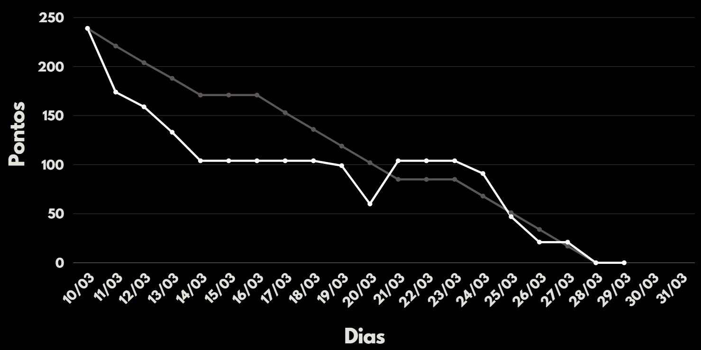

# Sprint 1 – Configuração Inicial e Operações Básicas

🗓 Previsão de Entrega: **30/03/2025**  
📌 Status: ✅ Concluído  
🎯 Objetivo: Cadastro, listagem, edição e exclusão de projetos.

---

## ✅ Funcionalidades Entregues

- Cadastro de projetos com persistência no banco de dados
- Listagem responsiva dos projetos
- Edição com confirmação visual
- Exclusão com verificação prévia
- Cadastro de usuários com validação de e-mail e senha

---

## 📊 Burndown

---

## 🎥 Apresentação

---

[⬅️ Voltar](https://github.com/CODEPLAY-Fatec/API-ADS-4-Sem-Fatec)
