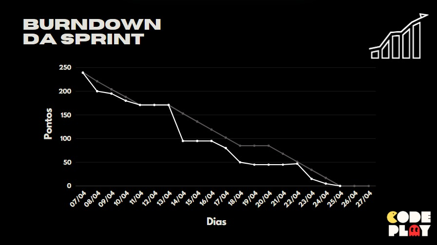

# Sprint 2 – Gestão de Projetos e Visualizações

🗓 Previsão de Entrega: **27/04/2025**  
📌 Status: ✅ Concluído  
🎯 Objetivo: Filtros de projetos, dashboard de acompanhamento, gestão de atividades.

---

## ✅ Funcionalidades Entregues

- Filtros por área de atuação, responsáveis e status dos projetos
- Dashboard com gráficos de progresso
- Cadastro de atividades vinculadas aos projetos
- Edição e exclusão de atividades
- Visualização consolidada dos dados dos projetos

---

## 📊 Burndown

---

## 🎥 Apresentação

---

[⬅️ Voltar](https://github.com/CODEPLAY-Fatec/API-ADS-4-Sem-Fatec)
